# FTR-Bench: Benchmarking Deep Reinforcement Learning for Flipper-Track Robot Control

## Introduce

This project uses the NuBot rescue robot as the platform and obstacles crossing as the task. It builds a reinforcement learning training system in Isaac Sim and implements commonly used reinforcement learning algorithms.

The major objective of FTR-Bench is to establish a learning framework that enables the articulated tracked robot to navigate obstacles in various terrains. Specifically, FTR-Bench consists of three primary components: the simulation, tasks, and learning algorithms.

Due to GitHub's limitations on video and file sizes, we have made the videos related to this work and experiments available [Video](docs/GitHub.mp4) for easier access and viewing.

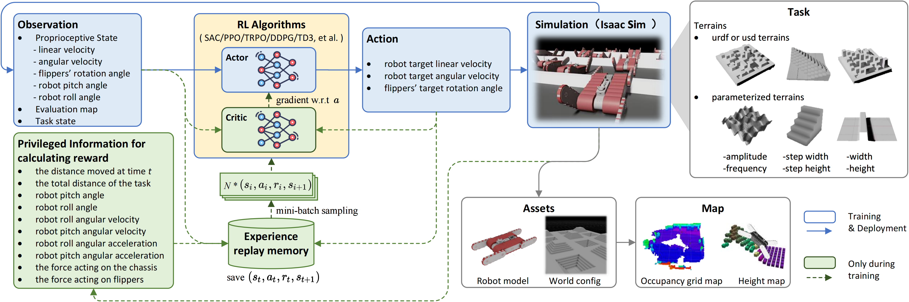

The flipper tracked robots have the capability to learn in various terrains. Considering real-world rescue robot applications, we have created four types of terrains, including flat ground, obstacles, bollards, and stairs. The task defines the conditions and objectives that the tracked robots need to meet in each scenario.

Eventually, our experiments demonstrate that RL can facilitate the robots to achieve some remarkable performance on such challenging tasks, enabling the agent to learn the optimal obstacle-navigation strategies within the environment. And there is still some room for improvement and more difficult tasks for future work.

### Tasks Design
#### Obstacle Crossing Tasks
We design multiple different terrains.
|        Task Name           |                                                                                              Description                                                                                              |                           Demo                            |
|:--------------------------:|:-----------------------------------------------------------------------------------------------------------------------------------------------------------------------------------------------------:|:---------------------------------------------------------:|
|        Up the Steps        |                                                   Simulate the tracked robot ascending steps. The height of the steps ranges from 0.2$m$ to 0.4$m$.                                                   |  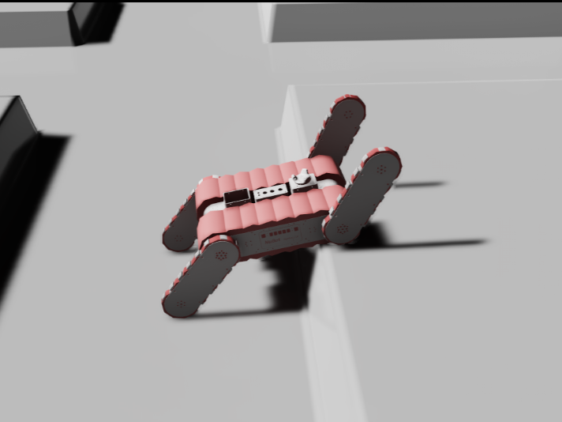   |
|       Down the Steps       |                                                  Simulate the tracked robot descending steps. The height of the steps ranges from 0.2$m$ to 0.6$m$.                                                   | 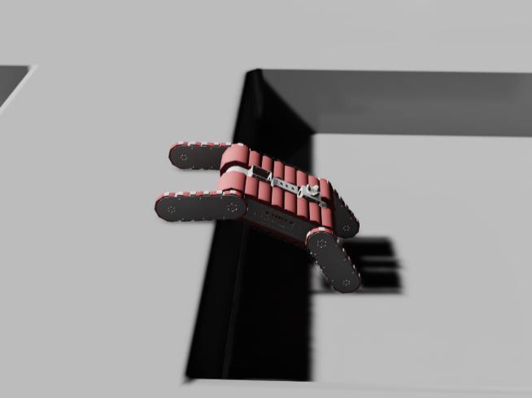  |
|     Cross the Uplifts      |                         Simulate the tracked robot crossing over uplifts. The height of the uplifts ranges from 0.2$m$ to 0.4$m$, and the width ranges from 0.2$m$ to 0.5$m$.                         |  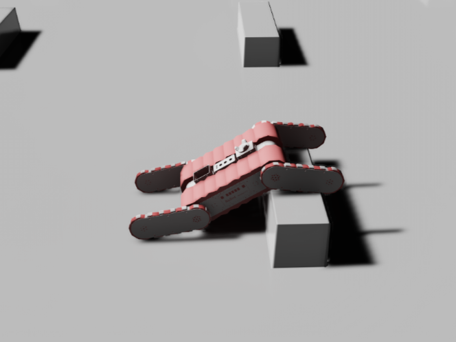   |
| Through Single-sided Steps |                                      Simulate a tracked robot going through a single-side step. The height of the single-side step ranges from 0.1$m$ to 0.3$m$.                                      |  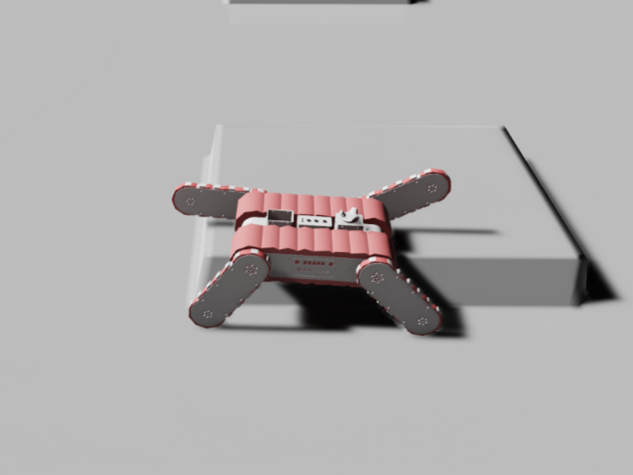  |
|    Drive on Plum Piles     |               Simulate the tracked vehicle navigating on plum piles. The size of each individual plum pile ranges from 0.2$m$ to 0.5$m$, and the height ranges from 0.2$m$ to 0.5$m$.                 | 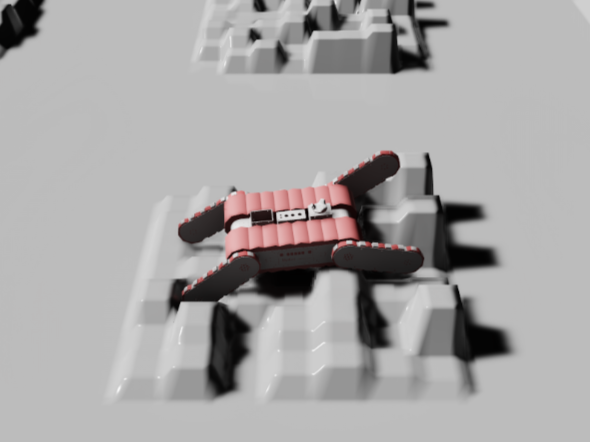  |
|   Drive on Wave Terrains   | Simulate the tracked vehicle navigating through waveform terrains. The size of each individual peak in the waveform terrain ranges from 0.25$m$ to 1$m$, and the height ranges from 0.1$m$ to 0.4$m$. |   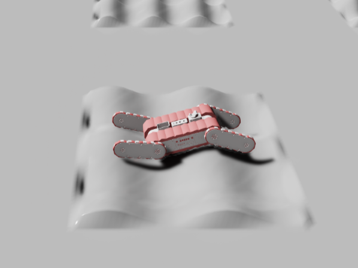    |
|      Cross the Rails       |                 Simulate the tracked robot crossing over rails. The height of the railing ranges from 0.2$m$ to 0.3$m$, and the angle with the vehicle ranges from 10 to 45 degrees.                  |   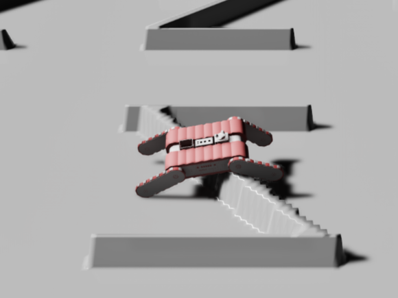    |
|       Up the Stairs        |              Simulate the tracked vehicle climbing stairs. The width of each step of the stairs ranges from 0.2$m$ to 0.3$m$, and the slope of the stairs ranges from 20 to 45 degrees.               |  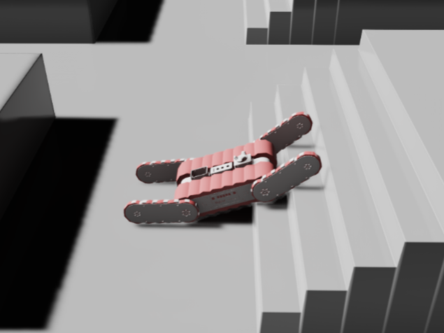  |
|      Down the Stairs       |             Simulate the tracked vehicle descending stairs. The width of each step of the stairs ranges from 0.2$m$ to 0.3$m$, and the slope of the stairs ranges from 20 to 45 degrees.              | 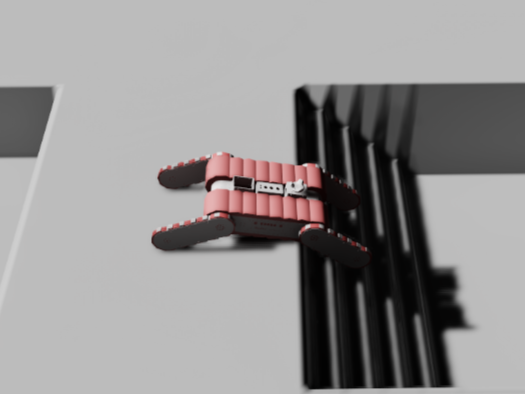 |
|       Mixed Terrains       |             Simulate the tracked vehicle navigating through various complex terrains, with the successful completion of the task defined when the vehicle reaches the specified endpoint.             |   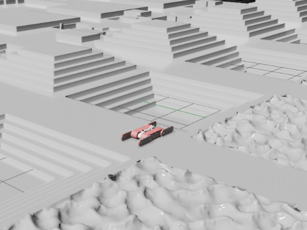    |

Different flipper structures can be achieved by modifying the [configuration file](ftr_envs/tasks/crossing/ftr_env.py).

#### Multi Agent Tasks
|    Task Name     |                                                        Description                                                        |                               Demo                               |
|:----------------:|:-------------------------------------------------------------------------------------------------------------------------:|:----------------------------------------------------------------:|
|    Push Cube     |                                  Three robots collaborate to push a heavy object forward                                  |   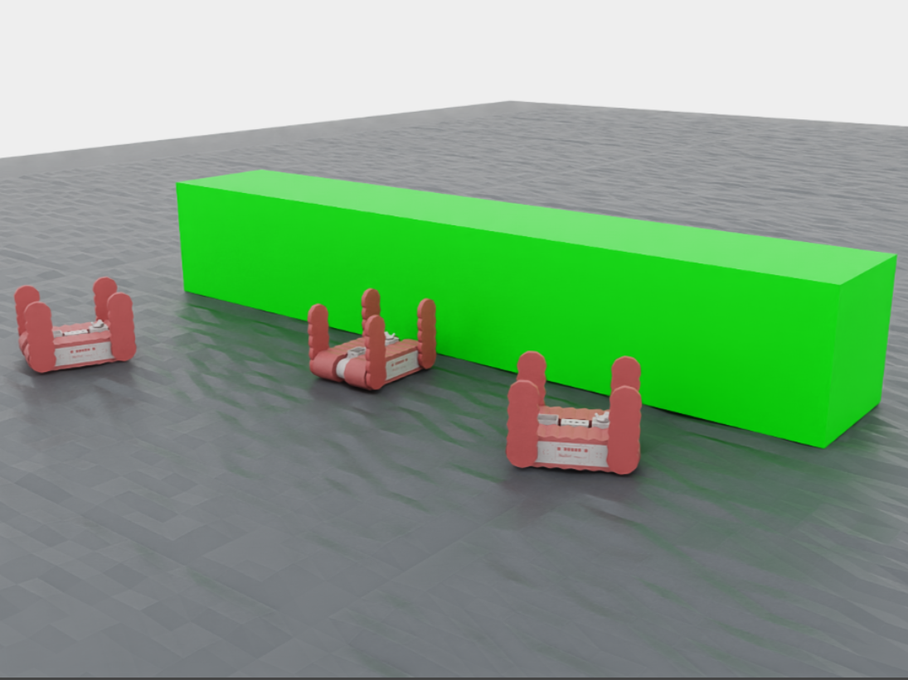   |
| Transfer Objects |                     Three robots work together to transfer a platform carrying a heavy load forward.                      | 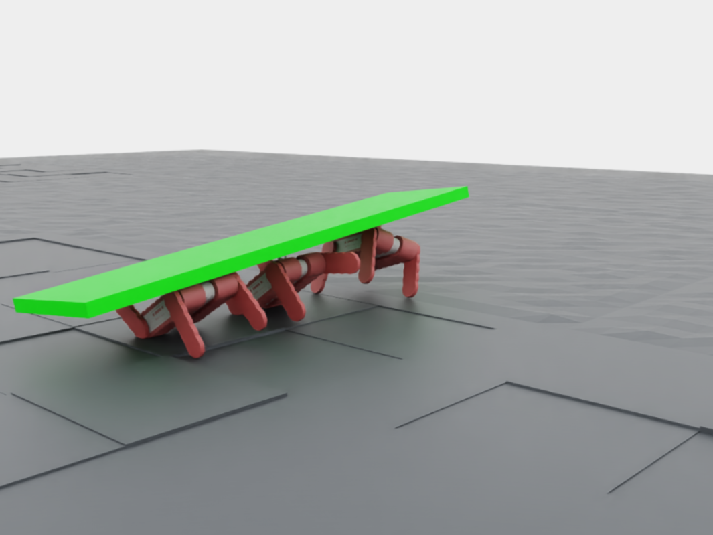 |
|    Predation     |                            Three red robots collaborate to encircle and capture a green robot.                            |     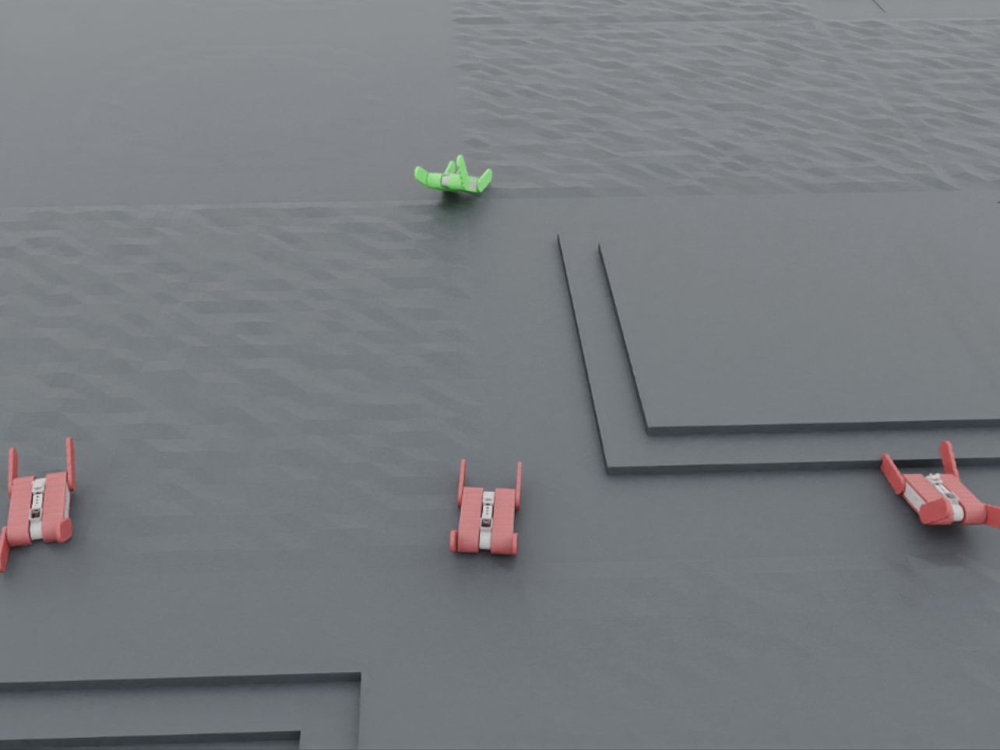      |

## Install

### Isaac Sim
The simulation platform used in this project is Isaac Sim, and version 4.2.0 is recommended. For detailed installation instructions, please refer to the official website installation address.

[download and install Isaac Sim](https://docs.omniverse.nvidia.com/app_isaacsim/app_isaacsim/install_workstation.html)

### Isaac Lab
Since this project is built on Isaac Lab, it is essential to install Isaac Lab first. You can refer to the following steps:
[Github](https://github.com/isaac-sim/IsaacLab) or
[Documentation](https://isaac-sim.github.io/IsaacLab/main/index.html)

### Install dependencies

Run the following commands to install the project dependencies:
~~~bash
~/.local/share/ov/pkg/isaac-sim-4.2.0/python.sh -m pip install -r requirements.txt
~~~

## Train

### Training Obstacle Crossing Tasks
To start training, you can execute the following code

~~~shell
~/.local/share/ov/pkg/isaac-sim-4.2.0/python.sh scripts/ftr_algo/train.py \
  --task Ftr-Crossing-Direct-v0 \
  --num_envs 256 \
  --algo sac \
  --terrain cur_base \
  --epoch 30000 \
  --experiment "test" \
  --headless
~~~

If you want to test the training results, you can use the following command

~~~shell
~/.local/share/ov/pkg/isaac-sim-4.2.0/python.sh scripts/ftr_algo/train.py \
  --task Ftr-Crossing-Direct-v0 \
  --num_envs 8 \
  --algo sac \
  --terrain cur_base \
  --epoch 30000 \
  --experiment "<checkpoint_path>" \
  --play
~~~

### Training Multi-Agent Tasks
To start training, you can execute the following code
~~~bash
~/.local/share/ov/pkg/isaac-sim-4.2.0/python.sh scripts/skrl/train.py \ 
  --task Ftr-Prey-v0 \
  --num_envs 64 \
  --algorithm IPPO \
  --headless \
  --seed 20 
~~~

### Training quadruped and humanoid robots
~~~bash
~/.local/share/ov/pkg/isaac-sim-4.2.0/python.sh scripts/skrl/train.py \ 
  --task Isaac-Velocity-Rough-Anymal-D-v1 \
  --num_envs 8
~~~

## Supported RL algorithms are listed below:

- Proximal Policy Optimization (PPO) ([Paper](https://arxiv.org/pdf/1707.06347.pdf), [Config](ftr_envs/tasks/crossing/agents/ftr_algo_ppo_cfg.yaml))
- Trust Region Policy Optimization (TRPO) ([Paper](https://arxiv.org/pdf/1502.05477.pdf), [Config](ftr_envs/tasks/crossing/agents/ftr_algo_trpo_cfg.yaml))
- Twin Delayed DDPG (TD3) ([Paper](https://arxiv.org/pdf/1802.09477.pdf), [Config](ftr_envs/tasks/crossing/agents/ftr_algo_td3_cfg.yaml))
- Soft Actor-Critic (SAC) ([Paper](https://arxiv.org/pdf/1812.05905.pdf), [Config](ftr_envs/tasks/crossing/agents/ftr_algo_sac_cfg.yaml))
- Deep Deterministic Policy Gradient (DDPG) ([Paper](https://arxiv.org/pdf/1509.02971.pdf), [Config](ftr_envs/tasks/crossing/agents/ftr_algo_ddpg_cfg.yaml))
- Multi-Agent PPO (MAPPO)([Paper](https://arxiv.org/pdf/2103.01955), [Config](ftr_envs/tasks/crossing/agents/ftr_algo_mappo_cfg.yaml))
- Herogeneous-Agent PPO (HAPPO)([Paper](https://arxiv.org/pdf/2304.09870), [Config](ftr_envs/tasks/crossing/agents/ftr_algo_happo_cfg.yaml))
- Herogeneous-Agent TRPO (HATRPO)([Paper](https://arxiv.org/pdf/2304.09870), [Config](ftr_envs/tasks/crossing/agents/ftr_algo_hatrpo_cfg.yaml))

## Enviroment Performance
<table>
    <tr>
        <th colspan="2">Up the Steps</th>
        <th colspan="2">Down the Steps</th>
    <tr>
    <tr>
        <td></td>
        <td>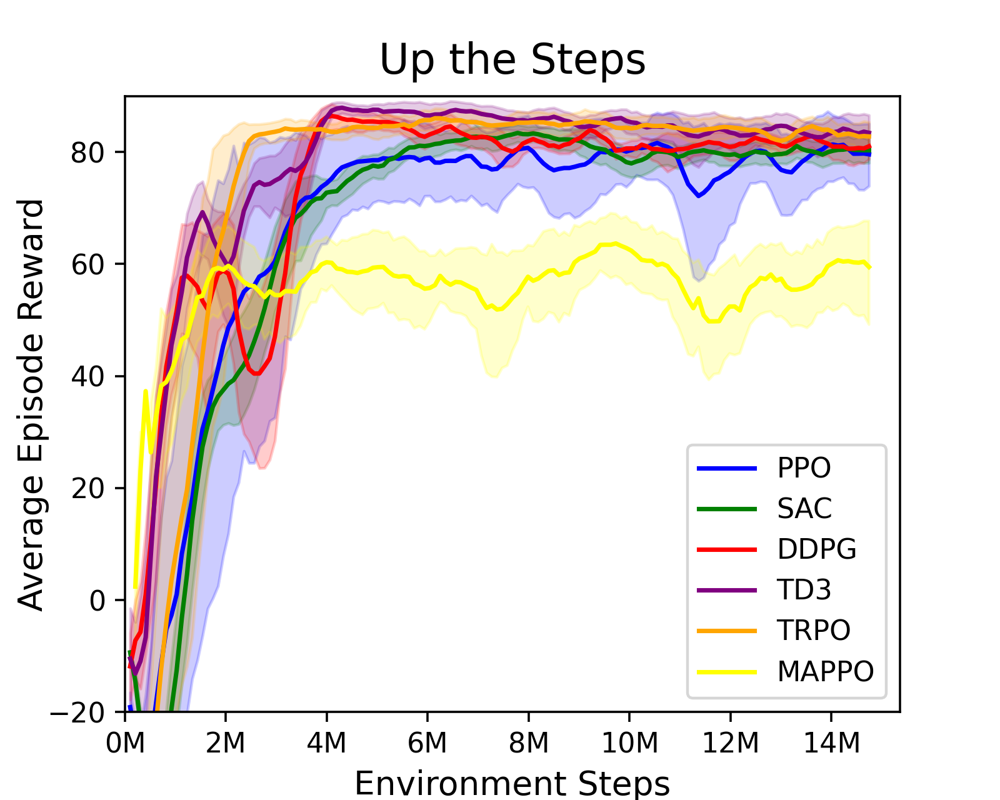</td>
        <td></td>
        <td>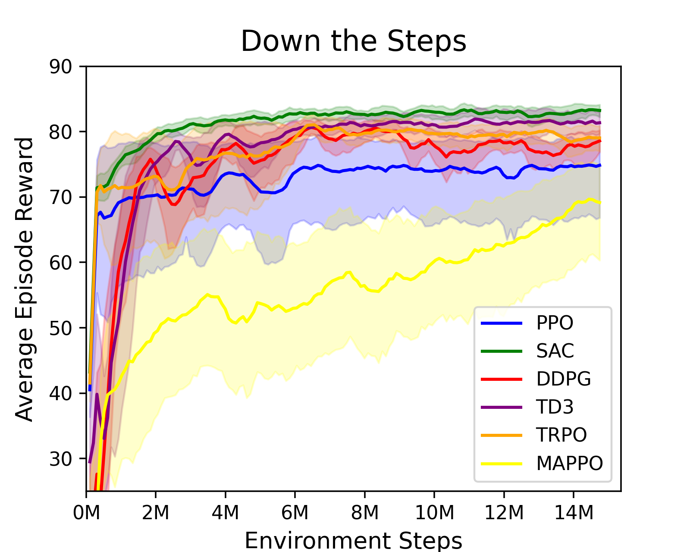</td>
    <tr>
    <tr>
        <th colspan="2">Cross the Uplifts</th>
        <th colspan="2">Through Single-sided Steps</th>
    <tr>
    <tr>
        <td></td>
        <td>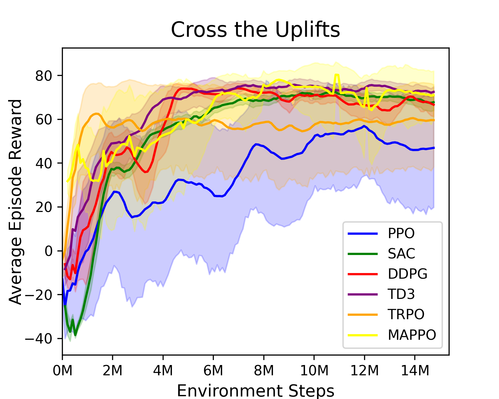</td>
        <td></td>
        <td>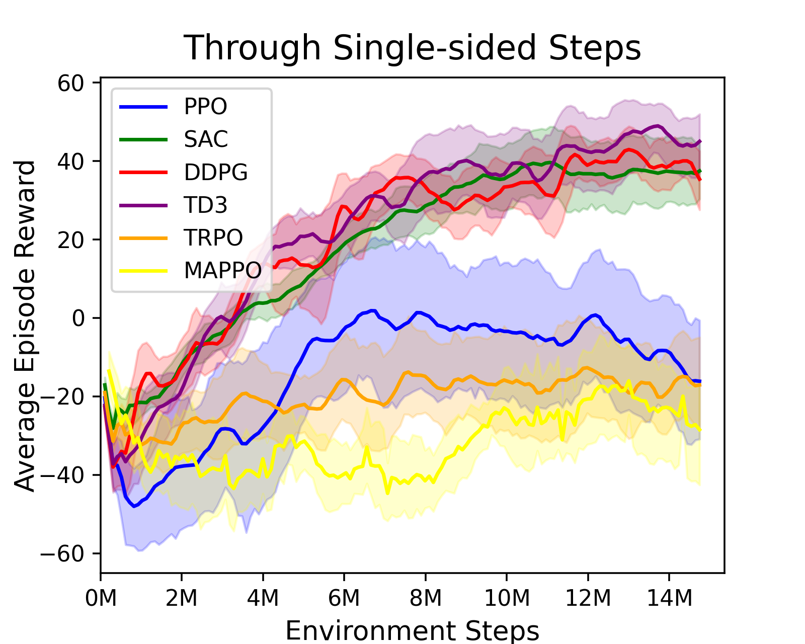</td>
    <tr>
    <tr>
        <th colspan="2">Drive on Plum Piles</th>
        <th colspan="2">Drive on Wave Terrains  </th>
    <tr>
    <tr>
        <td></td>
        <td>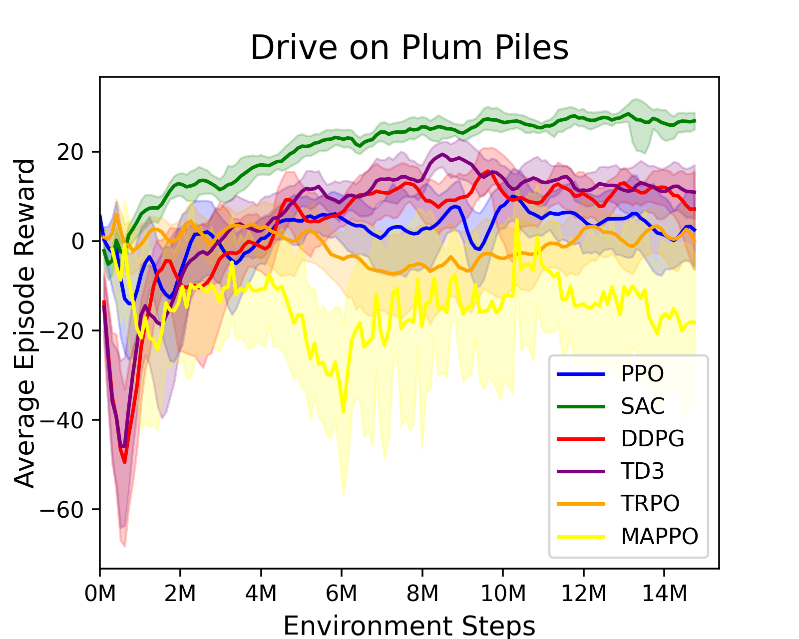</td>
        <td></td>
        <td>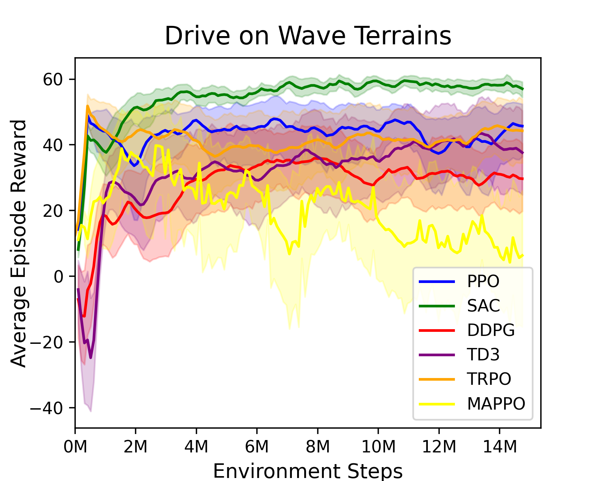</td>
    <tr>
    <tr>
        <th colspan="2">Cross the Rails</th>
        <th colspan="2">Up the Stairs </th>
    <tr>
    <tr>
        <td></td>
        <td>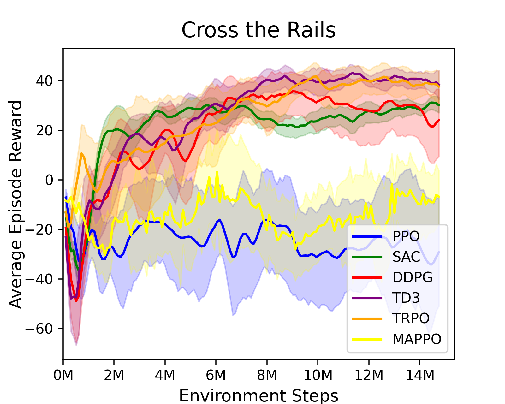</td>
        <td></td>
        <td>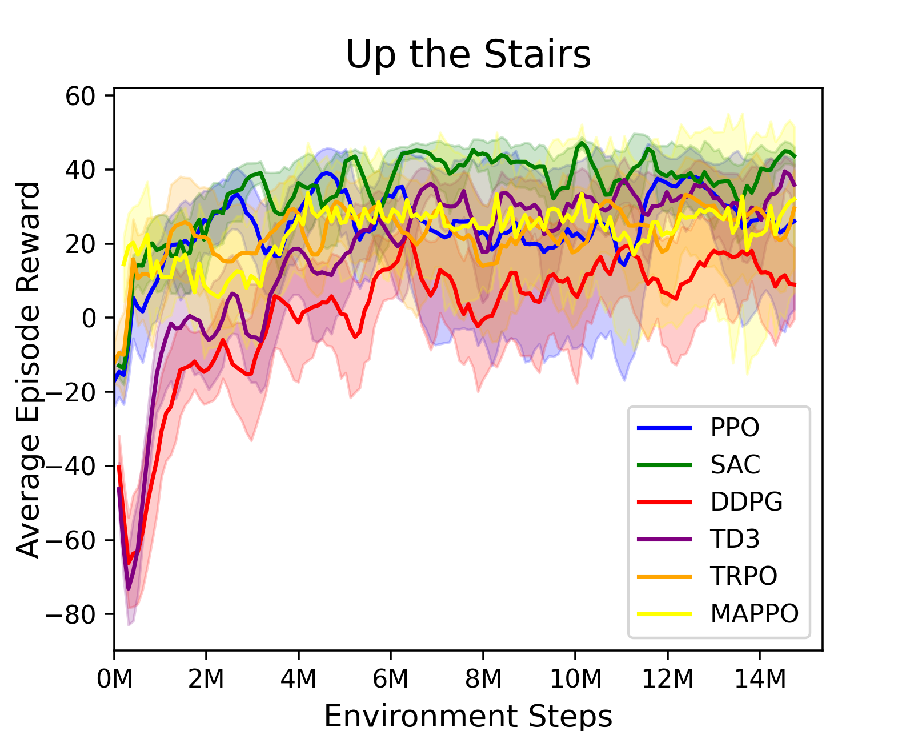</td>
    <tr>
    <tr>
        <th colspan="2">Down the Stairs </th>
        <th colspan="2">Mixed Terrains </th>
    <tr>
    <tr>
        <td></td>
        <td>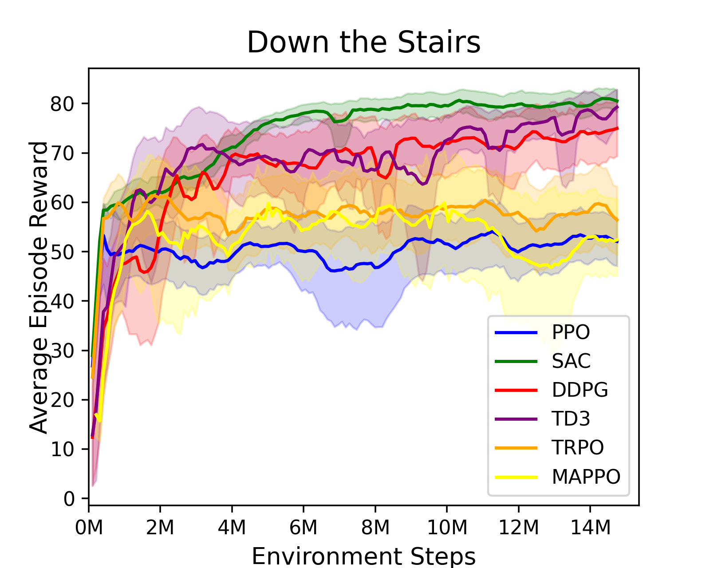</td>
        <td></td>
        <td>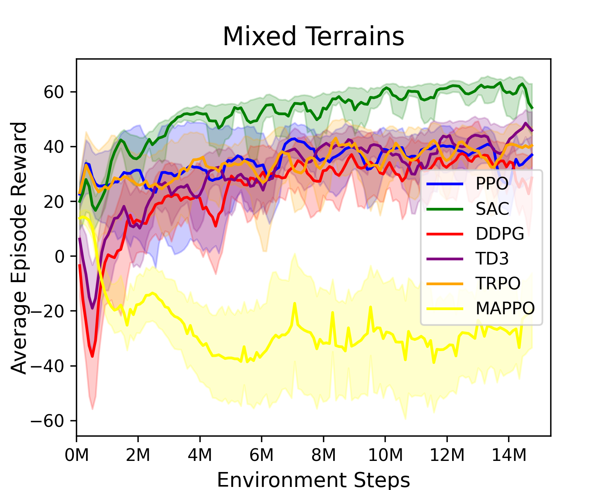</td>
    <tr>

    
</table>

Related experimental videos can be viewed：[Video](https://1drv.ms/v/s!AqEztC_CwayMgQCnpW-n8urBkmBb)

## Research papers published using FTR-Bench

(Click to Collapse)

- Research paper
  - [Geometry-Based Flipper Motion Planning for Articulated Tracked Robots Traversing Rough Terrain in Real-time](https://onlinelibrary.wiley.com/doi/abs/10.1002/rob.22236): Journal of Field Robotics, 2023,  https://doi.org/10.1002/rob.22236.
  - [Deep Reinforcement Learning for Flipper Control of Tracked Robots](https://arxiv.org/abs/2306.10352): ArXiv 2023, https://doi.org/10.48550/arXiv.2306.10352.

